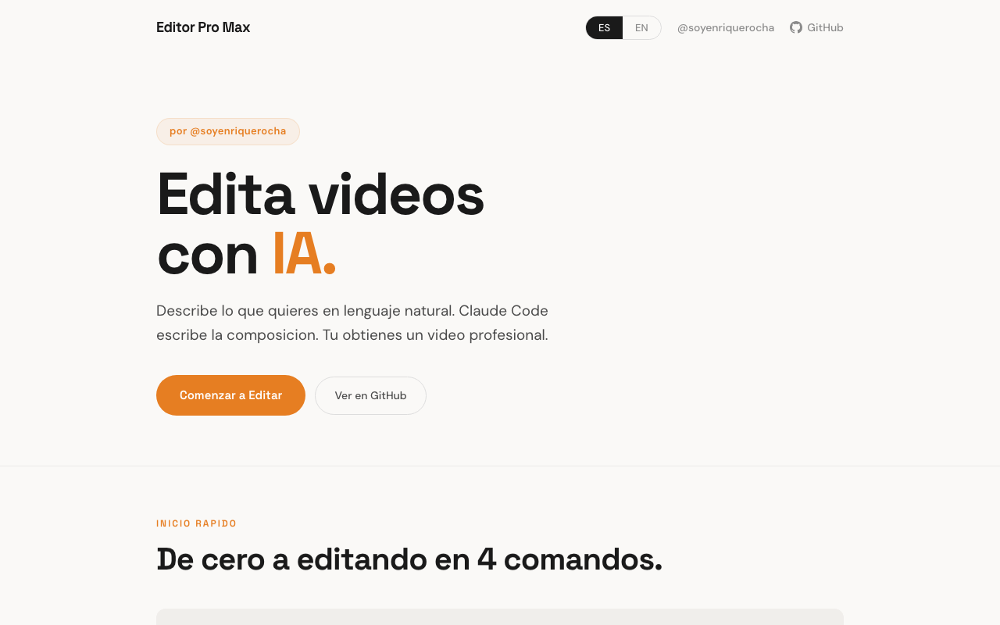

# AI Video Studio

**Crea videos virales con IA — sin línea de tiempo, sin software caro**

Built with Remotion + Claude Code | React 19 | TypeScript | Whisper AI



[English](#english) | [Español](#español)

---

## English

### What is this?

AI Video Studio turns Claude Code into your personal video production team. Describe the video you want in plain English — Claude writes the code, Remotion renders it to a real MP4. No timeline dragging. No GUI. No subscriptions.

Everything runs **100% locally** on your machine. No API keys needed.

### Quick Start

```bash
git clone https://github.com/highvalue-llc/ai-video-studio.git
cd ai-video-studio
claude
/start
```

The `/start` command installs all dependencies, verifies the build, and gives you your first video in under 5 minutes.

### How It Works

```
YOU (describe in plain text)
        ↓
  CLAUDE CODE (writes React + Remotion code)
        ↓
   REMOTION (renders real MP4 locally)
        ↓
   YOUR VIDEO (ready to post)
```

### What Can You Build?

**Viral Social Content**
- TikTok, Instagram Reels, YouTube Shorts (9:16)
- LinkedIn posts (1:1 square)
- Twitter/X clips

**Marketing Videos**
- Course promos with morphing benefits + countdown timer
- Product demos with animated feature callouts
- Testimonial compilations

**Edited Footage (Path B — existing video)**
- Auto-transcribe with Whisper AI (local, no API key)
- Jump-cut editing that removes silence automatically
- AI background removal
- Auto-captions synced to speech

### Component Library — 35 Components

| Category | Components |
|---|---|
| **Text** | AnimatedTitle, TypewriterText, WordByWordCaption, LowerThird, CaptionOverlay, **KaraokeCaption** *(new)*, **MorphingText** *(new)* |
| **Backgrounds** | GradientBackground, ParticleField, GridPattern, ColorWash, **GlassmorphismCard** *(new)* |
| **Overlays** | ProgressBar, Watermark, CallToAction, CountdownTimer, **NeonGlow** *(new)*, **SocialCounter** *(new)*, **FloatingTag** *(new)*, **EmojiReaction** *(new)* |
| **Media** | VideoClip, JumpCut, AudioTrack, FitVideo, FitImage, Slideshow |
| **Layout** | SplitScreen, PictureInPicture, SafeArea |
| **Transitions** | 12 preset transitions (Fade, Slide, Zoom, Wipe...) |

### Template Library — 15 Templates

| Category | Templates |
|---|---|
| **Social** | TikTokVideo, InstagramReel, YouTubeShort, **LinkedInPost** *(new)* |
| **Content** | Presentation, Testimonial |
| **Promo** | Announcement, BeforeAfter, **CoursePromo** *(new)* |
| **Editing** | TalkingHeadEdit, PodcastClip |

### AI Skill Packs — 10 Packs

Claude Code comes loaded with domain knowledge for video creation:

| Skill Pack | What it teaches Claude |
|---|---|
| `remotion-best-practices` | React-based video architecture, timing, frame math |
| `motion-designer` | Animation principles, easing, rhythm |
| `awwwards-animations` | Award-level motion design patterns |
| `animated-component-libraries` | Component reuse and composition patterns |
| `explainer-video-guide` | Explainer video structure and pacing |
| `ffmpeg` | Audio extraction, silence detection, video processing |
| `remotion-render` | Rendering pipeline, codecs, quality settings |
| `playwright-mcp` | Web scraping for dynamic content |
| **`viral-hooks`** *(new)* | 8 proven hook patterns that stop the scroll |
| **`creator-formats`** *(new)* | Platform-specific content formats and pacing rules |

### Platform Presets

| Platform | Dimensions | FPS | Typical Duration |
|---|---|---|---|
| TikTok / Reels / Shorts | 1080×1920 | 30 | 15–60s |
| YouTube | 1920×1080 | 30 | Any |
| LinkedIn / Square | 1080×1080 | 30 | 30–60s |
| Twitter/X | 1280×720 | 30 | 15–30s |
| Pinterest | 1000×1500 | 30 | 15–30s |

### Path A — Create from scratch

```
You: "Make a 30s TikTok hook for a course about AI automation.
      Hook: 'You're about to be replaced.' Benefits: 3 key outcomes.
      CTA: 'Comment CURSO for access.' Dark purple palette."

Claude: [writes the composition code]
Remotion: [renders your video]
```

### Path B — Edit existing footage

```bash
# 1. Drop your video in public/assets/
# 2. In Claude Code:
You: "Edit my video at public/assets/my-recording.mp4.
      Remove all silences, add auto-captions, brand with purple theme."

# Claude runs the pipeline:
scripts/extract-audio.ts    → extracts audio
scripts/transcribe.ts       → Whisper AI transcription (local)
scripts/detect-silence.ts   → marks silence segments
# Then writes a composition that jump-cuts and adds captions
```

### Prerequisites

- Node.js 18+
- [Claude Code CLI](https://claude.ai/code) (free to start)
- ffmpeg (for video editing features): `brew install ffmpeg`
- Whisper.cpp (for transcription): auto-installed on first use

### License

MIT — free for personal and commercial use.

Note: [Remotion](https://remotion.dev/license) requires a separate license for companies rendering 12+ videos/month.

---

## Español

### ¿Qué es esto?

AI Video Studio convierte a Claude Code en tu equipo de producción de video. Describís el video que querés en texto simple — Claude escribe el código, Remotion lo renderiza como un MP4 real. Sin arrastrar clips. Sin interfaz complicada. Sin suscripciones.

Todo corre **100% localmente** en tu máquina. Sin claves de API.

### Inicio Rápido

```bash
git clone https://github.com/highvalue-llc/ai-video-studio.git
cd ai-video-studio
claude
/start
```

El comando `/start` instala todo, verifica el build y te da tu primer video en menos de 5 minutos.

### Cómo Funciona

```
VOS (describís en texto)
        ↓
  CLAUDE CODE (escribe código React + Remotion)
        ↓
   REMOTION (renderiza un MP4 real localmente)
        ↓
   TU VIDEO (listo para publicar)
```

### ¿Qué Podés Crear?

**Contenido Social Viral**
- TikTok, Instagram Reels, YouTube Shorts (9:16)
- Posts de LinkedIn (cuadrado 1:1)
- Clips para Twitter/X

**Videos de Marketing**
- Promos de cursos con beneficios animados + cuenta regresiva
- Demos de productos con callouts animados
- Compilaciones de testimonios

**Edición de Material Existente (Path B)**
- Transcripción automática con Whisper AI (local, sin clave de API)
- Edición con jump-cuts que elimina silencios automáticamente
- Remoción de fondo con IA
- Subtítulos automáticos sincronizados con el habla

### Biblioteca de Componentes — 35 Componentes

Igual que arriba 👆 — todos disponibles en ES desde el primer `/start`.

### Camino A — Crear desde cero

```
Vos: "Hacé un TikTok de 30s para un curso de automatización con IA.
      Hook: 'Estás a punto de ser reemplazado.' Paleta oscura púrpura.
      CTA: 'Comentá CURSO para recibir el link.'"

Claude: [escribe el código de la composición]
Remotion: [renderiza tu video]
```

### Camino B — Editar material existente

```bash
# 1. Copiá tu video a public/assets/
# 2. En Claude Code:
Vos: "Editá mi video en public/assets/mi-grabacion.mp4.
      Eliminá los silencios, agregá subtítulos automáticos,
      aplicá tema visual morado."

# Claude ejecuta el pipeline completo automáticamente
```

### Requisitos

- Node.js 18+
- [Claude Code CLI](https://claude.ai/code) (gratis para empezar)
- ffmpeg: `brew install ffmpeg`
- Whisper.cpp (para transcripción): se instala solo al primer uso

### Licencia

MIT — libre para uso personal y comercial.

Nota: [Remotion](https://remotion.dev/license) requiere licencia separada para empresas que renderizan 12+ videos por mes.

---

## Contributing

We welcome contributions! Please read [CONTRIBUTING.md](CONTRIBUTING.md) before opening a PR.

**Good first contributions:**
- New components (check `src/components/` for existing patterns)
- New templates for underserved platforms
- New skill packs for Claude
- Better example compositions in `src/compositions/`

## Changelog

See [CHANGELOG.md](CHANGELOG.md) for version history.

---

Built with ❤️ using [Claude Code](https://claude.ai/code) + [Remotion](https://remotion.dev)
